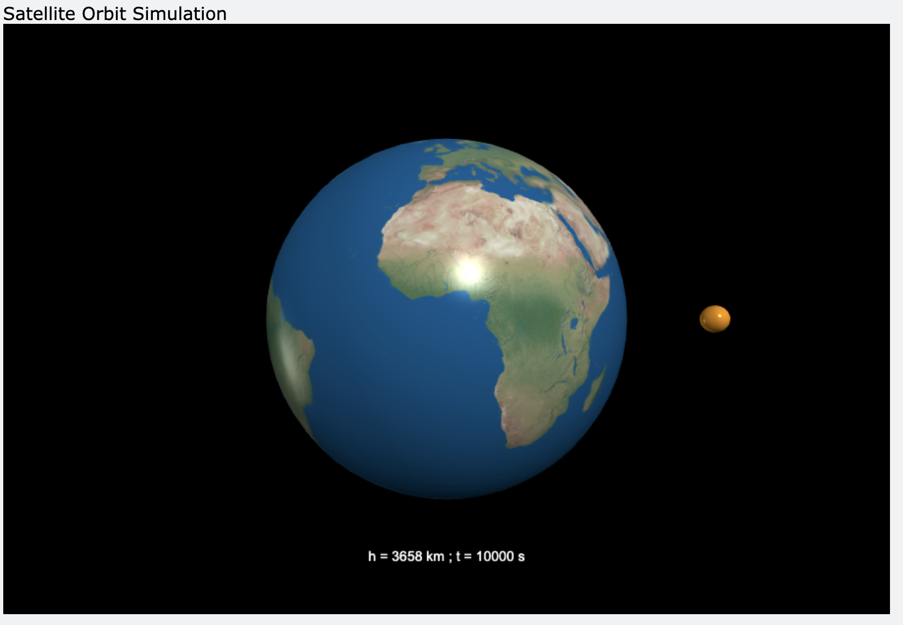

### Overview
- this is my solution for the exercise from "Computational Physics by Newman" (exercise 2.2), which includes the proof of the altidute of an satellite in the orbit and the contains h = 

$$
h = \frac{GMT^2}{4\pi^2}^1/3 - R, 
$$ 

- where $G = 6.67 x 10^{-11}m^3kg^{-1}s^{-2}$ (Newtons gravitiy constant); $M = 5.97 x 10^{24}kg$ the mass of Earth and $R = 6371km$ the radius of the Earth
- for example, the satellite reaches within 10.000 seconds 3658km outside the atmosphere: 
```bash
Please enter your desired seconds for orbiting the earth: 10000
Your altidute of your satellite is: 3657750.1053808797 (km)
Your altidute for once a day is 35832447.55432571 (km), for every 90min its 279321.63043892663 (km) and for every 45min its -2181559.8946194015 (km)
```

> this is a Screenshot from the simulation 
### Resources
[Computational Physics - Makr Newman, Exercise 2.2](https://www.amazon.de/s?k=Mark+Newman+%E2%80%93+Computational+Physics&i=stripbooks)
